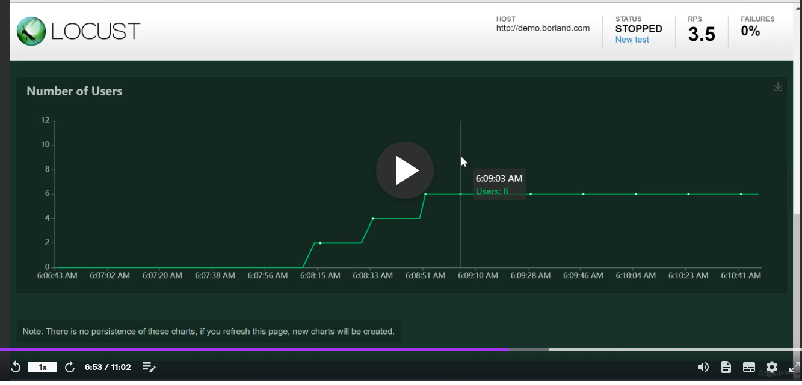

# Locust 

## Commands 

```bash
locust -f basic_http_host01.py -u 5 -r 1 -t 60s --headless
locust -f basic_http_host01.py -u 5 -r 1 -t 10s --headless --logfile mylog.log --loglevel DEBUG
locust -f on_start_stop.py -u 1 -r 1 --headless --only-summary
locust -f test_start_stop.py -u 2 -r 1 --headless --only-summary
locust -f basic_locust_taskdecorator_weight.py -u 1 -r 1 --headless --only-summary

locust -f basic_api.py -u 1 -r 1 --headless
```

## Linear Vs Step Load Model

```bash
locust -f Assignment_Solution_parametrize_NestedBorland.py  --step-load
```



```bash
locust -f Assignment_Solution_parametrize_NestedBorland.py --headless -u 10 -r 1 --step-load --step-user 2 --step-time 20s --run-time 2m  
```

## Master with Slaves


```bash
locust -f Assignment_Solution_parametrize_NestedBorland.py --master
locust -f Assignment_Solution_parametrize_NestedBorland.py --worker

locust -f Assignment_Solution_parametrize_NestedBorland.py --master --expect-worker 2 --headless -u 4 -r 2
locust -f Assignment_Solution_parametrize_NestedBorland.py --worker #worker 1
locust -f Assignment_Solution_parametrize_NestedBorland.py --worker #worker 2

locust --config config/master.yaml
locust --config config/worker.yaml
```